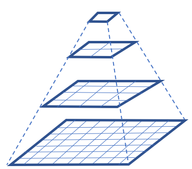

Load vector feature data from a GeoPackage
===============================================================

Introduction
------------

There are several different ways to create and read a GeoPackage. Most of the implementing software products have their own unique way of supporting the handling of a GeoPackage. In this chapter we will show how a GeoPackage can be read using the free and open source GDAL library.

For ease of reference, we reproduce the GeoPackage schema overview below.

.. image:: ../img/geopackage-overview.png
   :height: 327
   :width: 560

The ``gpkg_spatial_ref_sys`` table contains coordinate reference system definitions that are used to reference vector and tile data in user tables to locations on the earth.

The ``gpkg_contents`` table provides a list of all geospatial contents in a GeoPackage to allow applications to identify and describe geospatial data that is available for access and/or update.

The ``gpkg_geometry_columns`` table specifies the type of geometry supported by user data tables containing features.

The ``gpkg_tile_matrix_set`` table provides records identifying each tile pyramid user data table contained in the GeoPackage.

The ``gpkg_tile_matrix`` table documents the structure of the tile matrix at each zoom level in each tiles table.

The ``gpkg_extensions`` table or updateable view in a GeoPackage is used to indicate that a particular extension applies to a GeoPackage, a table in a GeoPackage, or a column of a table in a GeoPackage.

The ``gpkg_data_columns`` table stores a minimal description of the schema of feature and tile matrix data tables that supplements the data available from the SQLite sqlite_master table and pragma table_info(table_name) SQL function.

The ``gpkg_data_column_constraints`` table contains data to specify restrictions on basic data type column values.

The ``gpkg_metadata`` table allows for metadata to be stored inside the GeoPackage.

The ``gpkg_metadata_reference`` table relates metadata records stored in the gpkg_metadata to feature and tile data stored in the GeoPackage.

Why does GeoPackage have these tables?
-------------------------------------------------------

The GeoPackage standard implements the OGC OpenGIS® Simple Features Interface Standard (SFS) which provides a common way for applications to store and access feature data in relational or object-relational databases. The specific tables that play a key role in this are the ``gpkg_geometry_columns`` , ``gpkg_spatial_ref_sys``, ``gpkg_contents`` and a user-named table that contains the feature properties. Use of the SFS by GeoPackage allows implementations of the GeoPackage standard to make use of the large number of spatial reference systems available from registers such as the `EPSG Geodetic Parameter Registry  <https://www.epsg-registry.org/>`_. Use of the SFS by GeoPackage also makes GeoPackages interoperable with other formats that use the SFS, for example the OGC Geography Markup Language (GML). This means that data can be exchanged between a GeoPackage and other SFS-based formats with minimal or no information loss because the data models are based on a common feature model.

The GeoPackage standard adopts a tile-based pyramid structure for storing imagery and raster maps at multiple resolutions. An illustration of this structure is shown below. The specific tables that play a key role in storage of such data include ``gpkg_tile_matrix_set`` , ``gpkg_tile_matrix`` , ``gpkg_contents`` and a user-named table that contains the actual binary encoded tiles. This tile-based pyramid structure is particularly useful when handling a GeoPackage on small or constrained devices such as mobile phones, tablets or laptops because an appropriate resolution can be selected based on the zoom level and the device screen size.

Using the GDAL/OGR library
-------------------------------------

There are alternative ways of accessing a GeoPackage, including through use of other prorgamming languages and libraries. One of the software libraries that offers this ability is the free and open source Geospatial Data Abstraction Layer (GDAL) and its vector toolkit, OGR. GDAL offers C, C++ and Python bindings that allow it to be imported into a variety of applications.

To build and install GDAL on Windows, Linux or Mac OS X, the source code can downloaded from the `GDAL website <http://www.gdal.org/usergroup0.html>`_.

For a quick start, GDAL 1.11 is also installed during the installation of QGIS.

An example Python script for reading a GeoPackage using GDAL 1.11 is below. The source code has been adapted from `here <http://gdal.org/1.11/ogr/ogr_apitut.html>`_. When the program runs it prints out the values of feature properties.

.. code-block:: python

      import sys
      import ogr
      # First open a handle on the GeoPackage.
      ds = ogr.Open( "/home/ogckm/Downloads/states10.gpkg" )
      # If the file handle is null then exit
      if ds is None:
          print "Open failed.\n"
          sys.exit( 1 )
      # Select the dataset to retrieve from the GeoPackage and assign it to an layer instance called lyr.
      # The names of available datasets can be found in the gpkg_contents table.
      lyr = ds.GetLayerByName( "statesQGIS" )
      # Refresh the reader
      lyr.ResetReading()
      # for each feature in the layer, print the feature properties
      for feat in lyr:

          feat_defn = lyr.GetLayerDefn()
          # for each non-geometry feature property, print its value
          for i in range(feat_defn.GetFieldCount()):
              field_defn = feat_defn.GetFieldDefn(i)

              if field_defn.GetType() == ogr.OFTInteger:
                  print "%d" % feat.GetFieldAsInteger(i)
              elif field_defn.GetType() == ogr.OFTReal:
                  print "%.3f" % feat.GetFieldAsDouble(i)
              elif field_defn.GetType() == ogr.OFTString:
                  print "%s" % feat.GetFieldAsString(i)
              else:
                  print "%s" % feat.GetFieldAsString(i)
          # Confirm whether there is a geometry property
          geom = feat.GetGeometryRef()
          if geom is not None and geom.GetGeometryType() == ogr.wkbMultiPolygon:
              print "has a geometry property"
          print "\n"

      ds = None

Note that GDAL 2.0 uses a different set of classes for accessing vector data. We have used GDAL 1.11 in this example because it is currently included by default in Linux repositories and also comes bundled within QGIS.
